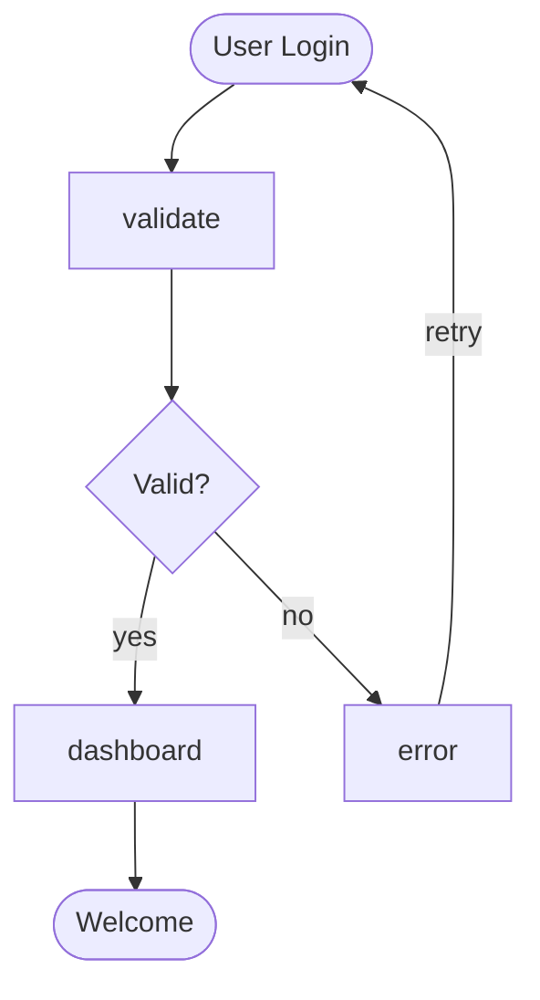

# MermaidAid

A simplified language for creating Mermaid diagrams with intuitive syntax that translates to standard Mermaid diagram code. Write diagrams 90% faster with natural, human-readable syntax.

## ✨ Key Features

- **🚀 Ultra-compact syntax** - 90% less code than standard Mermaid
- **🧠 Smart inference** - Automatically detects node types from names
- **🔗 Chained connections** - Connect multiple nodes in one line
- **💬 Natural language** - Reads like plain English
- **🎯 Visual symbols** - Intuitive shortcuts (`@` start, `!` end, `?` decision)
- **📝 Comment support** - Document your diagrams inline
- **⚡ Multiple diagram types** - Flowcharts, sequence diagrams, and class diagrams
- **🛠️ CLI tool** - Easy command-line interface for file processing
- **🔧 TypeScript implementation** - Built with TypeScript for reliability and type safety
- **📚 Comprehensive documentation** - Extensive guides and examples

## 🎯 Quick Example

**MermaidAid** (simple and intuitive):
```mad
flow
@ user_login: User Login
user_login -> validate -> ? auth: Valid?
auth -> dashboard: yes -> ! welcome: Welcome
auth -> error: no -> user_login: retry
```

**Generated Mermaid** (standard output):


## 📖 Documentation

Complete documentation is available in the [`docs/`](docs/) directory:

- **[📚 Quick Start Guide](docs/quick-start.md)** - Get up and running in 5 minutes
- **[📖 Language Reference](docs/language-reference.md)** - Complete syntax reference
- **[💡 Examples](docs/examples/README.md)** - Comprehensive example collection
- **[🚀 Advanced Features](docs/advanced-features.md)** - Power user techniques
- **[🔧 API Reference](docs/api-reference.md)** - Programmatic usage
- **[✅ Best Practices](docs/best-practices.md)** - Guidelines for maintainable diagrams
- **[🔄 Migration Guide](docs/migration-guide.md)** - Upgrade and migration instructions
- **[🛠️ Troubleshooting](docs/troubleshooting.md)** - Common issues and solutions

## 📦 Installation

### NPM Installation (Recommended)
```bash
# Install globally for CLI usage
npm install -g mermaidaid

# Or install locally in your project
npm install mermaidaid
```

### From Source
```bash
# Clone the repository
git clone <repository-url>
cd mermaidaid

# Install dependencies
npm install

# Build the project
npm run build

# Link for global usage (optional)
npm link
```

### Verify Installation
```bash
# If installed globally
mermaidaid --help

# If running from source
node dist/cli.js --help
```

## 💻 Usage

### Command Line Interface

```bash
# Display help
mermaidaid --help

# Show syntax examples
mermaidaid --examples

# Convert a .mad file to Mermaid
mermaidaid input.mad

# Save output to file
mermaidaid input.mad -o output.mmd

# Process multiple files
mermaidaid examples/*.mad
```

**Note:** If you installed from source or locally, replace `mermaidaid` with `node dist/cli.js`

### As a Library

```typescript
import { translateToMermaid } from 'mermaidaid';

const simplifiedDiagram = `
flow
@ start: Begin Process
start -> validate -> ? decision -> ! end
decision -> error: failed
error -> start: retry
`;

const mermaidCode = translateToMermaid(simplifiedDiagram);
console.log(mermaidCode);
```

### Real-World Example

```mad
// E-commerce checkout process
flow
@ cart: Shopping Cart
cart -> login -> ? authenticated: Logged in?

// Guest checkout path
authenticated -> guest_checkout: no, proceed as guest
guest_checkout -> shipping_info -> payment -> confirmation

// Authenticated user path  
authenticated -> saved_addresses: yes, load profile
saved_addresses -> ? use_saved: Use saved address?
use_saved -> payment: yes
use_saved -> new_address: no -> payment

// Payment processing
payment -> ? payment_success: Payment processed?
payment_success -> order_complete: yes -> ! success: Order confirmed
payment_success -> payment_error: no -> payment: retry

// Error handling
payment_error -> ? retry_payment: Try again?
retry_payment -> payment: yes
retry_payment -> ! abandoned: no, cart abandoned
```

## Syntax Guide

### Ultra-Compact Flowcharts with Chained Connections

```
flow
@ start: Begin Process
start -> validate -> ? decision -> ! success
decision -> error: failed
error -> start: retry
```

### Smart Node Inference

The language automatically infers node types from names:

```
flow
login -> validate -> decision -> success
decision -> failure: rejected
failure -> login: retry
```

**Smart Inference Rules:**
- Names with `start`, `begin`, `init`, `launch` → start nodes (rounded)
- Names with `end`, `finish`, `success`, `done`, `complete` → end nodes (rounded)
- Names with `check`, `valid`, `decide`, `choice`, `?` → decision nodes (diamonds)
- Everything else → process nodes (rectangles)

### Enhanced Symbol-Based Nodes

```
flow
@ login: User Login
login -> auth
? auth: Valid Credentials?
auth -> home: yes
auth -> error: no
! home: Dashboard
error -> login: try again
```

**Node Type Symbols:**
- `@` or `○` - Start nodes (rounded)
- `!` or `●` - End nodes (rounded)  
- `?` or `<>` - Decision nodes (diamonds)
- `□` - Process nodes (rectangles, default)

**Connection Syntax:**
- `nodeA -> nodeB` - Simple arrow
- `nodeA -> nodeB: label` - Arrow with label
- `nodeA <-> nodeB` - Bidirectional arrow
- `A -> B -> C -> D` - Chained connections

### Natural Language Style

```
flow
@ begin: User opens app
begin -> authenticate -> ? valid: Check credentials?
valid -> dashboard: yes
valid -> error: no
! dashboard: Welcome screen
error -> begin: try again
```

### Compact Sequence Diagrams

```
seq
user -> app: login
app -> db: validate
db -> app: user data
app -> user: welcome
```

### Simple Class Diagrams

```
class
User
Account
Product
Order
```

**Language Shortcuts:**
- `flow` = `flowchart`
- `seq` = `sequence`
- Labels don't need quotes unless they contain special characters
- Chain connections: `A -> B -> C -> D`
- Comment support: `// This is a comment`
- Smart node type inference from names
- Multi-word labels: `node: Multi word label`

## Enhanced Features

### 🔗 Chained Connections
Connect multiple nodes in one line:
```
start -> validate -> decision -> end
```

### 🧠 Smart Node Inference  
Automatically detects node types from names:
```
login -> validate -> success  // validate becomes decision, success becomes end
```

### 💬 Comment Support
Add comments anywhere:
```
flow
// This is the main flow
start -> process  // Process the data
```

### 🎯 Enhanced Symbols
Use intuitive symbols for node types:
```
@ start    // Start node
? decision // Decision node  
! end      // End node
```

## Examples

The `examples/` directory contains sample `.mad` files:

- `examples/flowchart.mad` - Basic flowchart example
- `examples/sequence.mad` - Sequence diagram example

## 🔄 Output

The tool generates standard Mermaid syntax that works with:

- **[Mermaid Live Editor](https://mermaid.live/)** - Online diagram editor
- **GitHub & GitLab** - Native support in markdown files
- **VS Code** - With Mermaid extensions
- **Documentation tools** - GitBook, Confluence, Notion
- **Static site generators** - Jekyll, Hugo, Gatsby
- **Any tool** that supports standard Mermaid syntax

## 🏗️ Development

### Project Structure

```
mermaidAid/
├── src/                    # Source code
│   ├── cli/               # Command-line interface
│   ├── parser/            # Lexer and parser
│   ├── translator/        # Mermaid code generation
│   ├── types/             # TypeScript type definitions
│   └── mermaidaid.ts      # Main library entry point
├── docs/                  # Comprehensive documentation
│   ├── examples/          # Example documentation
│   ├── quick-start.md     # Getting started guide
│   ├── language-reference.md  # Complete syntax reference
│   ├── advanced-features.md   # Power user guide
│   ├── api-reference.md   # Programmatic API docs
│   ├── best-practices.md  # Guidelines and patterns
│   ├── migration-guide.md # Version migration help
│   └── troubleshooting.md # Common issues and solutions
├── examples/              # Sample .mad files
│   ├── basic/            # Beginner examples
│   ├── real-world/       # Production scenarios
│   ├── industry/         # Domain-specific workflows
│   └── features/         # Feature demonstrations
├── dist/                 # Compiled JavaScript output
├── package.json          # Project configuration
├── tsconfig.json         # TypeScript configuration
├── LICENSE               # MIT license
└── README.md             # This file
```

### Building

```bash
# Build the project
npm run build

# Development with watch mode
npm run watch

# Clean build directory
npm run clean
```

### Scripts

The following npm scripts are available:

- **`npm run build`** - Compile TypeScript to JavaScript
- **`npm run watch`** - Development mode with automatic rebuilding
- **`npm start`** - Run the CLI tool
- **`npm run clean`** - Clean build directory
- **`npm run dev`** - Run with ts-node for development

### VS Code Tasks

Several VS Code tasks are configured for common operations:

- **Build MermaidAid** - Compile the project
- **Test Examples** - Run example files
- **Show Examples** - Display syntax examples

## 🎯 Language Design Goals

1. **🎯 Simplicity** - Reduce verbosity of standard Mermaid syntax by 90%
2. **📖 Readability** - Human-readable syntax that reads like natural language
3. **🔗 Compatibility** - Generates standard Mermaid output that works everywhere
4. **🔧 Extensibility** - Easy to add new diagram types and features
5. **🚀 Performance** - Fast parsing and translation for large diagrams
6. **📚 Maintainability** - Self-documenting syntax that's easy to maintain

## 🤝 Contributing

We welcome contributions from the community! Here's how you can help:

### Getting Started

1. **Fork the repository** on GitHub
2. **Clone your fork** locally
   ```bash
   git clone https://github.com/yourusername/mermaidAid.git
   cd mermaidAid
   ```
3. **Create a feature branch**
   ```bash
   git checkout -b feature/amazing-feature
   ```
4. **Make your changes** and test thoroughly
5. **Commit your changes**
   ```bash
   git commit -m "Add amazing feature"
   ```
6. **Push to your branch**
   ```bash
   git push origin feature/amazing-feature
   ```
7. **Submit a pull request** with a clear description

### What to Contribute

- **🐛 Bug fixes** - Help us squash bugs
- **✨ New features** - Add diagram types, syntax improvements
- **📖 Documentation** - Improve guides, add examples
- **🧪 Examples** - Real-world use cases and patterns
- **🔧 Tools** - Migration scripts, IDE extensions
- **🚀 Performance** - Optimization and efficiency improvements

### Contribution Guidelines

- **Follow TypeScript best practices**
- **Add tests for new features**
- **Update documentation** for any changes
- **Use descriptive commit messages**
- **Ensure all examples still work**
- **Follow the existing code style**

### Code Style

- Use TypeScript with strict type checking
- Follow clean code principles
- Add JSDoc comments for public methods
- Use async/await for asynchronous operations
- Implement proper error handling

### Testing Your Changes

```bash
# Build the project
npm run build

# Test with example files
node dist/cli.js examples/flowchart.mad

# Run all tests
npm test

# Test specific features
npm run test:advanced-features
```

## 📄 License

MIT License - see [LICENSE](LICENSE) file for details.

## 🚀 Future Enhancements

### Planned Features

- **📊 More diagram types** - ERD, Gantt charts, Git graphs, User journeys
- **🎨 Advanced styling** - Custom themes, colors, fonts
- **📦 Subgraph support** - Nested and grouped diagrams
- **⚙️ Configuration files** - Project-wide settings and preferences
- **👀 Watch mode** - Automatic compilation on file changes
- **🔌 VS Code extension** - Syntax highlighting, live preview, IntelliSense
- **🌐 Web interface** - Online editor and converter
- **📱 Mobile support** - Touch-friendly diagram creation
- **🔗 Integration APIs** - REST API for diagram generation
- **📋 Template system** - Reusable diagram templates

### Long-term Vision

- **🎯 Domain-specific languages** - Specialized syntax for different industries
- **🔄 Bi-directional conversion** - Convert Mermaid back to MermaidAid
- **📊 Analytics** - Diagram complexity analysis and optimization suggestions
- **🌍 Internationalization** - Multi-language support
- **🤝 Collaboration** - Real-time collaborative editing

### Community Roadmap

The future of MermaidAid is driven by community needs. Join our discussions:

- **GitHub Issues** - Feature requests and bug reports
- **Discussions** - Ideas and community feedback
- **Discord** - Real-time community chat
- **Roadmap** - Public roadmap with voting on features

## 🙏 Acknowledgments

- **Mermaid.js** - The excellent diagramming library that powers our output
- **TypeScript** - For providing excellent type safety and developer experience
- **Community Contributors** - Everyone who has contributed code, documentation, and feedback
- **Early Adopters** - Users who provided valuable feedback during development

## 📞 Support & Community

- **📖 Documentation** - Comprehensive guides in the [`docs/`](docs/) directory
- **💬 GitHub Discussions** - Community Q&A and feature discussions
- **🐛 Issues** - Bug reports and feature requests
- **📧 Email** - For private inquiries and business partnerships
- **🐦 Twitter** - Follow for updates and announcements

---

**Ready to get started?** Check out the [Quick Start Guide](docs/quick-start.md) or browse the [Examples](examples/) to see MermaidAid in action!
