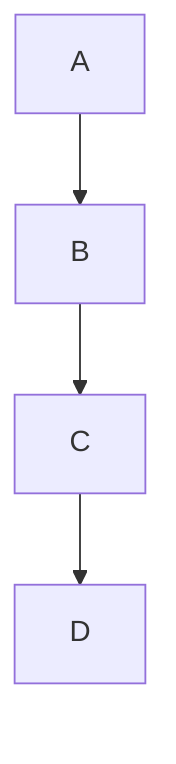

# Chained Connections Feature

MermaidAid supports chained connections, allowing you to connect multiple nodes in a single line for ultra-compact diagrams.

## Basic Chaining

### Simple Chain
```mad
flow
A -> B -> C -> D
```

**Generated Mermaid:**


### Chain with Labels
```mad
flow
start -> validate -> process -> end
validate -> error: invalid
```

## Advanced Chaining

### Mixed Node Types
```mad
flow
@ start -> authenticate -> ? valid -> ! success
valid -> error: failed -> start: retry
```

### Complex Chains with Branches
```mad
flow
@ user_login -> check_credentials -> ? auth_result -> profile_load -> ! dashboard
auth_result -> error_handler: failed -> retry_prompt -> user_login: try again
profile_load -> customize_ui -> load_preferences -> dashboard
```

## Chaining with Symbols

### Symbol-Based Compact Flow
```mad
flow
@ begin: Start Process -> validate: Check Input -> ? decision: Valid? -> ! complete: Done
decision -> error: Invalid Input -> begin: Restart
```

### Ultra-Compact Business Process
```mad
flow
@ order -> validate -> ? payment -> inventory -> ship -> ! delivered
payment -> decline: failed -> notify -> ! cancelled
inventory -> backorder: unavailable -> notify -> ship
```

## Natural Language Chaining

### When-Then Flow
```mad
flow
when user submits form -> validate input -> if data is valid -> save to database -> then show success message
if data is valid -> show error message: invalid data -> when user submits form: fix and retry
```

### Conditional Chains
```mad
flow
@ start: User Request -> authenticate -> if user is valid -> load dashboard -> ! welcome
if user is valid -> show login: access denied -> authenticate: retry
```

## Best Practices for Chaining

### 1. Keep Chains Readable
```mad
// Good: Clear linear flow
flow
@ start -> step1 -> step2 -> step3 -> ! end

// Better: Add descriptive labels
flow
@ start: Begin -> step1: Validate -> step2: Process -> step3: Save -> ! end: Complete
```

### 2. Break Complex Chains
```mad
// Good: Complex logic broken into manageable chains
flow
// Main happy path
@ login -> authenticate -> validate -> profile -> ! dashboard

// Error handling
authenticate -> error: failed -> retry -> login: again
validate -> incomplete: missing data -> profile: update required
```

### 3. Mix Chains with Single Connections
```mad
// Good: Combine techniques for clarity
flow
// Main workflow chain
@ start -> validate -> process -> save -> ! complete

// Error branches (single connections for clarity)
validate -> error: validation failed
error -> start: retry process

// Optional features
save -> audit_log: record action
save -> notification: send email
```

## Performance Benefits

Chained connections reduce:
- **Line count** by 60-80%
- **Visual clutter** in complex diagrams
- **Maintenance overhead** when updating flows

### Before (Standard Syntax)
```mad
flow
A -> B
B -> C
C -> D
D -> E
E -> F
```

### After (Chained Syntax)
```mad
flow
A -> B -> C -> D -> E -> F
```

## Common Patterns

### Linear Workflow
```mad
flow
@ start -> step1 -> step2 -> step3 -> step4 -> ! end
```

### Fork and Join
```mad
flow
@ start -> split -> branch1 -> join -> ! end
split -> branch2 -> join
split -> branch3 -> join
```

### Loop with Chain
```mad
flow
@ begin -> process -> check -> ? done -> ! complete
done -> process: continue -> check
```

### Error Recovery Chain
```mad
flow
@ start -> step1 -> step2 -> step3 -> ! success
step1 -> error1: fail -> recover1 -> step2
step2 -> error2: fail -> recover2 -> step3
step3 -> error3: fail -> recover3 -> start: restart
```
