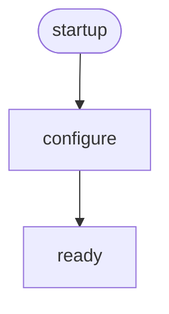
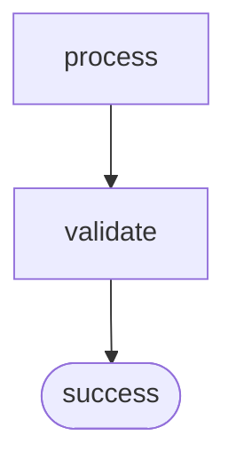
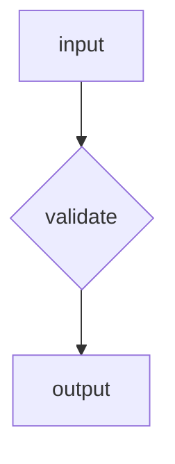

# Smart Node Inference Feature

MermaidAid automatically detects node types from naming patterns, making diagrams more intuitive and requiring less explicit markup.

## How Smart Inference Works

The system analyzes node names and automatically assigns appropriate node types based on common naming patterns.

## Start Node Detection

### Keywords that trigger start nodes:
- `start`, `begin`, `init`, `launch`, `open`, `enter`
- `startup`, `initialize`, `boot`, `load`, `create`

```mad
flow
startup -> configure -> ready
```

**Generated Mermaid:**


### Real-world examples:
```mad
flow
// Application lifecycle
boot_system -> load_config -> initialize_services -> start_server

// User workflow  
user_opens_app -> authenticate_user -> load_dashboard

// Data processing
begin_import -> validate_data -> process_records -> complete_import
```

## End Node Detection

### Keywords that trigger end nodes:
- `end`, `finish`, `success`, `done`, `complete`, `exit`
- `terminate`, `close`, `final`, `stop`, `accomplished`

```mad
flow
process -> validate -> success
```

**Generated Mermaid:**


### Real-world examples:
```mad
flow
// Order processing
create_order -> payment -> fulfillment -> complete

// File operations
open_file -> edit_content -> save_changes -> close

// Workflow completion
assign_task -> work_on_task -> review -> done
```

## Decision Node Detection

### Keywords that trigger decision nodes:
- `check`, `valid`, `decide`, `choice`, `test`, `verify`
- `confirm`, `approve`, `evaluate`, `assess`, `determine`

```mad
flow
input -> validate -> output
```

**Generated Mermaid:**


### Real-world examples:
```mad
flow
// Form processing
submit_form -> validate_input -> save_data
validate_input -> show_errors: invalid

// Access control
login_attempt -> verify_credentials -> grant_access
verify_credentials -> deny_access: failed

// Quality control
manufacture_product -> test_quality -> ship_product
test_quality -> reject_product: failed
```

## Advanced Pattern Recognition

### Context-Aware Detection
The system considers the entire flow context:

```mad
flow
// Smart inference in action
user_login -> authenticate -> check_permissions -> dashboard_access
check_permissions -> access_denied: insufficient rights
access_denied -> contact_admin -> end_session
```

**Result:**
- `user_login` → process node (action)
- `authenticate` → process node (action)
- `check_permissions` → decision node (validation)
- `dashboard_access` → process node (action)
- `access_denied` → process node (action)
- `contact_admin` → process node (action)
- `end_session` → end node (termination)

### Multi-word Pattern Matching
```mad
flow
system_startup -> configuration_check -> service_initialization -> application_ready
configuration_check -> configuration_error: invalid config
configuration_error -> system_shutdown
```

## Combining with Explicit Symbols

You can mix smart inference with explicit symbols:

```mad
flow
// Explicit start, smart inference for middle, explicit end
@ user_registration -> validate_email -> create_account -> ! welcome_message
validate_email -> email_error: invalid format
email_error -> user_registration: try again
```

## Complex Business Process Example

```mad
flow
// Order fulfillment with smart inference
customer_order -> inventory_check -> payment_processing -> order_confirmation
inventory_check -> backorder_notification: out of stock
payment_processing -> payment_failure -> customer_notification
payment_failure -> order_cancellation
backorder_notification -> supplier_request -> inventory_update -> payment_processing
order_confirmation -> shipping_preparation -> package_dispatch -> delivery_complete
```

**Smart inference results:**
- `customer_order` → process (action)
- `inventory_check` → decision (validation)
- `payment_processing` → process (action)
- `order_confirmation` → process (action)
- `payment_failure` → process (error state)
- `delivery_complete` → end (completion)

## Overriding Smart Inference

When you need specific node types that don't match naming patterns:

```mad
flow
// Force specific types with symbols
@ login_screen: User sees login  // Force start node
process_login -> ? force_decision: Override inference  // Force decision
normal_process -> ! force_end: Override inference  // Force end
```

## Best Practices

### 1. Use Descriptive Names
```mad
// Good: Descriptive names enable smart inference
flow
user_registration -> email_validation -> account_creation -> welcome_complete

// Better: Mix descriptive names with strategic symbols
flow
@ user_starts_registration -> validate_email_format -> create_user_account -> ! registration_complete
```

### 2. Leverage Common Patterns
```mad
// Common workflow patterns
flow
// Data processing pipeline
data_import -> validate_format -> transform_data -> save_results -> processing_complete

// Approval workflow  
submit_request -> manager_review -> approval_decision -> notification_sent
approval_decision -> rejection_notice: denied -> submit_request: resubmit
```

### 3. Combine with Error Handling
```mad
// Error handling with smart inference
flow
file_upload -> virus_scan -> format_validation -> storage_complete
virus_scan -> quarantine_file: threat detected -> security_alert
format_validation -> format_error: unsupported -> user_notification
```

## Performance and Maintenance Benefits

### Reduced Markup
- **80% less** explicit node type declarations
- **Natural language** naming becomes functional
- **Self-documenting** diagrams through descriptive names

### Maintenance Advantages
- Node types automatically update when names change
- Consistent behavior across similar processes
- Less chance of incorrect node type assignments

### Before (Explicit Types)
```mad
flow
@ start: Begin Process
start -> validate
? validate: Check Data?
validate -> process: valid
? process: Process Data?
process -> ! success: Success
```

### After (Smart Inference)
```mad
flow
begin_process -> validate_data -> process_information -> complete_successfully
validate_data -> data_error: invalid -> begin_process: retry
```
