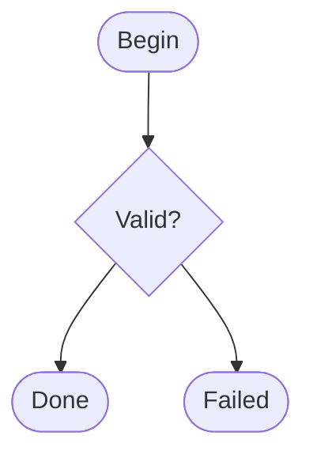

# Symbol Shortcuts

Learn how to use MermaidAid's intuitive visual symbols for creating clear, expressive diagrams.

## Overview

MermaidAid provides visual symbols that make node types immediately recognizable and reduce the need for verbose syntax. These symbols are inspired by common flowchart conventions and make diagrams more intuitive.

## Available Symbols

### Start/End Nodes
- `@` or `○` - Start nodes (rendered as rounded rectangles)
- `!` or `●` - End nodes (rendered as rounded rectangles)

### Decision Nodes
- `?` or `<>` - Decision nodes (rendered as diamonds)

### Process Nodes
- `□` - Process nodes (rendered as rectangles, default type)

## Basic Usage

### Simple Symbol Usage
```mad
flow
@ start: Begin Process
start -> process_data
process_data -> ? validation: Data Valid?
validation -> save_data: yes
validation -> error_handling: no
save_data -> ! success: Process Complete
error_handling -> ! failure: Process Failed
```

### Alternative Symbol Styles
```mad
flow
○ begin: Start Application
begin -> initialize
initialize -> <> check_config: Configuration OK?
check_config -> main_app: valid
check_config -> error_display: invalid
main_app -> ● complete: Application Ready
error_display -> ● failed: Startup Failed
```

## Advanced Symbol Patterns

### Mixed Symbol Usage
```mad
flow
// Explicit symbols where clarity is important
@ user_registration: New User Registration
user_registration -> validate_email
validate_email -> ? email_valid: Email Format OK?

// Process nodes (default, no symbol needed)
email_valid -> create_account: yes
create_account -> setup_profile
setup_profile -> send_welcome_email

// Multiple end states with explicit symbols
send_welcome_email -> ! registration_complete: Account Created
email_valid -> ! invalid_email: Registration Failed
```

### Symbol Inference Override
```mad
flow
// Sometimes you want to override smart inference
login_process -> authenticate

// Force as process node (override inference that might make it an end node)
authenticate -> □ complete_setup: Setup Complete

// Explicit decision (override inference)
complete_setup -> ? needs_tutorial: Show Tutorial?
needs_tutorial -> tutorial: yes
needs_tutorial -> ! dashboard: no, go to dashboard
```

## Symbol Style Guide

### When to Use Symbols

**✅ Use symbols when:**
- Starting and ending points need emphasis
- Multiple end states exist
- Decision points need highlighting
- Clarity is more important than brevity

**❌ Avoid symbols when:**
- Smart inference already provides the right type
- Diagram becomes cluttered with too many symbols
- Simple linear flows where types are obvious

### Symbol Consistency

```mad
// Good: Consistent symbol usage
flow
@ order_start: New Order
order_start -> validate_order
validate_order -> ? order_valid: Order Valid?
order_valid -> process_payment: yes
order_valid -> ! order_rejected: no
process_payment -> ? payment_success: Payment OK?
payment_success -> ! order_complete: yes
payment_success -> ! payment_failed: no

// Also good: No symbols (smart inference)
flow
order_start -> validate_order -> order_valid
order_valid -> process_payment: yes
order_valid -> order_rejected: no
process_payment -> payment_success
payment_success -> order_complete: yes
payment_success -> payment_failed: no
```

## Symbol Reference

### Visual Comparison

| Symbol | Syntax | Rendered As | Use Case |
|--------|--------|-------------|----------|
| `@` | `@ node: Label` | Rounded rectangle | Process start points |
| `○` | `○ node: Label` | Rounded rectangle | Alternative start symbol |
| `!` | `! node: Label` | Rounded rectangle | Process end points |
| `●` | `● node: Label` | Rounded rectangle | Alternative end symbol |
| `?` | `? node: Label` | Diamond | Decision points |
| `<>` | `<> node: Label` | Diamond | Alternative decision symbol |
| `□` | `□ node: Label` | Rectangle | Explicit process nodes |

### Mermaid Output

**MermaidAid Input:**
```mad
flow
@ start: Begin
start -> ? check: Valid?
check -> ! success: Done
check -> ! error: Failed
```

**Generated Mermaid:**


## Best Practices

### 1. Use Symbols Sparingly

**❌ Symbol overuse:**
```mad
flow
@ start: Start
start -> □ process1: Process 1
process1 -> □ process2: Process 2  
process2 -> ? decision: Decision?
decision -> □ process3: Process 3
process3 -> ! end: End
```

**✅ Strategic symbol use:**
```mad
flow
@ start: Start
start -> process1 -> process2 -> ? decision
decision -> process3 -> ! end
```

### 2. Emphasize Important Nodes

```mad
flow
// Complex workflow with strategic symbol placement
user_request -> validate_input -> process_request

// Important decision point
process_request -> ? critical_check: Security Check?

// Critical failure path
critical_check -> ! security_violation: access denied

// Normal success path
critical_check -> generate_response: approved -> send_response -> ! request_complete
```

### 3. Multiple End States

```mad
flow
@ application_start: Start Application
application_start -> load_config -> validate_config

validate_config -> ? config_valid: Configuration Valid?

// Different types of completion
config_valid -> initialize_services: yes -> ! startup_success: Ready
config_valid -> ! config_error: no, configuration error

// Error handling with explicit end states
initialize_services -> service_error: failed -> ! startup_failed: Service Error
```

## Common Patterns

### Error Handling
```mad
flow
@ process_start: Begin
process_start -> step1 -> step2 -> ? validation

// Success path
validation -> final_step: valid -> ! success: Complete

// Error paths with clear endings
validation -> ! validation_error: invalid data
step1 -> ! step1_error: step 1 failed  
step2 -> ! step2_error: step 2 failed
```

### Multi-Path Workflows
```mad
flow
@ user_action: User Action
user_action -> ? user_type: User Type?

// Different paths for different user types
user_type -> admin_flow: admin -> admin_processing -> ! admin_complete
user_type -> user_flow: regular -> user_processing -> ! user_complete  
user_type -> guest_flow: guest -> guest_processing -> ! guest_complete

// Common error handling
admin_processing -> ! error: failed
user_processing -> ! error: failed
guest_processing -> ! error: failed
```

### State Machines
```mad
flow
@ idle: System Idle
idle -> ? event: Event Received?

event -> processing: start -> ? result: Success?
event -> ! shutdown: stop

result -> idle: success, return to idle
result -> ! error_state: failure
result -> processing: retry
```

## Integration with Smart Inference

Symbols work alongside smart inference - use symbols when you need explicit control:

```mad
flow
// Smart inference handles most cases
user_login -> authenticate -> load_preferences

// Explicit symbols for important points
load_preferences -> ? first_time_user: First Time?
first_time_user -> tutorial: yes -> ! onboarding_complete
first_time_user -> dashboard: no -> ! login_complete

// Override inference when needed
authenticate -> □ log_access: Log Access  // Force process type
log_access -> security_check
```

## Examples

### E-commerce Checkout
```mad
flow
@ cart_review: Review Cart
cart_review -> ? has_account: Have Account?

has_account -> login: yes -> payment
has_account -> guest_checkout: no -> payment

payment -> ? payment_result: Payment Success?
payment_result -> ! order_confirmed: yes
payment_result -> ! payment_failed: no
```

### System Startup
```mad
flow
@ system_boot: System Boot
system_boot -> hardware_check -> software_check -> ? all_systems_ok

all_systems_ok -> service_startup: yes -> ! system_ready
all_systems_ok -> ! boot_failure: no

service_startup -> service_error: failed -> ! startup_error
```

### Document Processing
```mad
flow
@ document_upload: Upload Document
document_upload -> virus_scan -> ? clean: Virus Free?

clean -> format_check: yes -> ? supported: Format OK?
clean -> ! security_blocked: no

supported -> process_document: yes -> ! processing_complete
supported -> ! unsupported_format: no
```

## Troubleshooting

### Common Issues

1. **Symbol not recognized**
   - Ensure space after symbol: `@ start:` not `@start:`
   - Check for typos in symbol characters

2. **Unexpected node types**
   - Smart inference may override symbols in some cases
   - Use explicit symbols when specific types are required

3. **Visual inconsistency**
   - Mix of symbols and inference can look inconsistent
   - Choose either symbol-heavy or inference-heavy style per diagram

### Best Symbol Combinations

```mad
// Recommended pattern for complex flows
flow
@ start: Clear Starting Point
start -> processing_steps
processing_steps -> ? major_decision: Important Choice?
major_decision -> more_processing: path 1
major_decision -> ! early_exit: path 2, end early
more_processing -> ! final_result: Complete
```

Symbol shortcuts make MermaidAid diagrams more expressive and easier to understand at a glance, while maintaining the clean, minimal syntax that makes the language so powerful.
