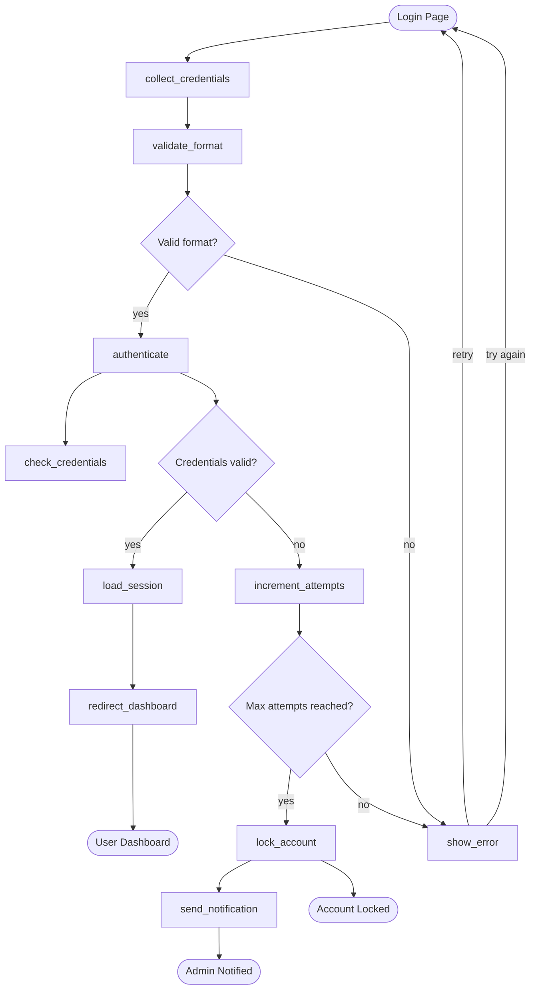

# User Authentication Flow

A complete user authentication workflow demonstrating real-world MermaidAid usage.

## MermaidAid Source

```mad
flow
# User Authentication Workflow
@ login_page: Login Page
login_page -> collect_credentials: user enters info
collect_credentials -> validate_format: check format
validate_format -> ? format_valid: Valid format?

# Format validation branch
format_valid -> authenticate: yes -> check_credentials
format_valid -> show_error: no -> login_page: retry

# Authentication process
authenticate -> ? auth_success: Credentials valid?
auth_success -> load_session: yes -> create session
auth_success -> increment_attempts: no -> check attempts

# Failed login handling
increment_attempts -> ? max_attempts: Max attempts reached?
max_attempts -> lock_account: yes -> send_notification: notify admin
max_attempts -> show_error: no -> login_page: try again

# Successful login flow
load_session -> redirect_dashboard: prepare dashboard
redirect_dashboard -> ! dashboard: User Dashboard

# Account lockout flow  
lock_account -> ! locked_page: Account Locked
send_notification -> ! admin_notified: Admin Notified
```

## Generated Mermaid



## Real-World Features

### Security Considerations
- Input format validation
- Attempt limiting
- Account lockout mechanism
- Admin notifications

### User Experience
- Clear error messages  
- Retry mechanisms
- Smooth successful flow
- Informative end states

### Error Handling
- Multiple validation layers
- Graceful failure paths
- Recovery options
- Administrative oversight

## Usage in Production

This pattern is commonly used for:
- Web application login
- Mobile app authentication  
- API security endpoints
- Administrative systems

The diagram clearly shows all possible user paths and security measures, making it perfect for:
- Security reviews
- QA testing scenarios
- Documentation
- Onboarding new developers
