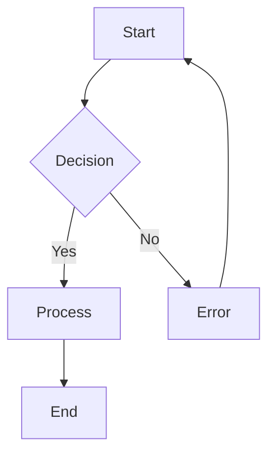
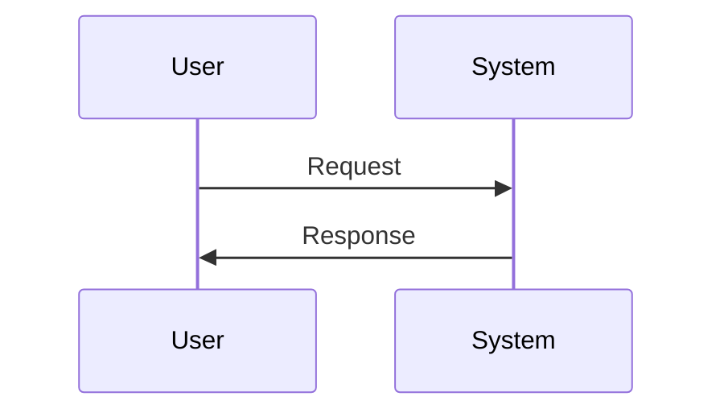
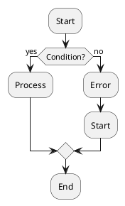

# Migration Guide

Guide for migrating between MermaidAid versions and from other diagram tools.

## Table of Contents

1. [Version Migration](#version-migration)
2. [From Standard Mermaid](#from-standard-mermaid)
3. [From Other Tools](#from-other-tools)
4. [Breaking Changes](#breaking-changes)
5. [Upgrade Strategies](#upgrade-strategies)
6. [Compatibility Matrix](#compatibility-matrix)

## Version Migration

### From v1.x to v2.x

#### New Features in v2.x
- Enhanced smart inference
- Natural language syntax
- Improved chaining
- Better error messages
- Performance optimizations

#### Breaking Changes
- Comment syntax changed from `#` to `//`
- Some node inference rules updated
- CLI argument changes

#### Migration Steps

1. **Update Comment Syntax**
   ```diff
   # Old v1.x syntax
   - # This is a comment
   - start -> end # End comment
   
   # New v2.x syntax
   + // This is a comment
   + start -> end // End comment
   ```

2. **Update CLI Usage**
   ```diff
   # Old v1.x
   - mermaidaid --input file.mad --output file.mmd
   
   # New v2.x
   + mermaidaid file.mad -o file.mmd
   ```

3. **Check Node Inference Rules**
   ```diff
   # Old v1.x - manual symbols required
   - @ start: Begin
   - ! finish: End
   
   # New v2.x - smart inference
   + start_process: Begin
   + complete_task: End
   ```

#### Automated Migration Tool

```bash
# Install migration tool
npm install -g mermaidaid-migrate

# Migrate single file
mermaidaid-migrate upgrade file.mad

# Migrate entire directory
mermaidaid-migrate upgrade ./diagrams/ --recursive
```

### From v0.x to v1.x

#### Major Changes
- Introduction of symbol-based nodes
- Chained connections
- Multi-diagram support

#### Migration Script

```javascript
// migration-v0-to-v1.js
const fs = require('fs');

function migrateV0ToV1(content) {
  return content
    .replace(/^(\w+)\s*->\s*(\w+)$/gm, '$1 -> $2')
    .replace(/^begin\s*->/gm, '@ begin ->')
    .replace(/-> end$/gm, '-> ! end');
}

// Usage
const oldContent = fs.readFileSync('old.mad', 'utf8');
const newContent = migrateV0ToV1(oldContent);
fs.writeFileSync('new.mad', newContent);
```

## From Standard Mermaid

### Flowchart Migration

#### Standard Mermaid


#### MermaidAid Equivalent
```mad
flow
@ start: Start
start -> ? decision: Decision
decision -> process: Yes
decision -> error: No
process -> ! end: End
error -> start
```

#### Automated Conversion Tool

```bash
# Convert Mermaid to MermaidAid
mermaidaid convert --from mermaid input.mmd -o output.mad

# Batch conversion
find . -name "*.mmd" -exec mermaidaid convert --from mermaid {} \;
```

### Sequence Diagram Migration

#### Standard Mermaid


#### MermaidAid Equivalent
```mad
seq
user -> system: Request
system -> user: Response
```

### Migration Patterns

| Mermaid Pattern | MermaidAid Pattern | Notes |
|-----------------|-------------------|-------|
| `A[Label]` | `a: Label` | Rectangle nodes |
| `A((Label))` | `@ a: Label` | Start/end nodes |
| `A{Label}` | `? a: Label` | Decision nodes |
| `A-->B` | `a -> b` | Simple arrow |
| `A-->|Label|B` | `a -> b: Label` | Labeled arrow |

## From Other Tools

### From Draw.io/Lucidchart

1. **Export as text** from your current tool
2. **Identify patterns** in your diagrams
3. **Map to MermaidAid syntax**

#### Common Patterns
```mad
# Linear processes
flow
@ start -> step1 -> step2 -> step3 -> ! end

# Decision trees
flow
@ input -> ? validate -> process -> ! success
validate -> error: invalid -> input: retry

# Parallel processes
flow
@ start -> fork
fork -> branch1 -> join
fork -> branch2 -> join
join -> ! end
```

### From PlantUML

#### PlantUML Activity Diagram


#### MermaidAid Equivalent
```mad
flow
@ start: Start
start -> ? condition: Condition?
condition -> process: yes
condition -> error: no
process -> ! end: End
error -> start
```

### Migration Tool

```bash
# Install converter
npm install -g diagram-converter

# Convert from PlantUML
diagram-converter --from plantuml --to mermaidaid input.puml

# Convert from Draw.io XML
diagram-converter --from drawio --to mermaidaid diagram.xml
```

## Breaking Changes

### v2.0.0 Breaking Changes

1. **Comment Syntax**
   - **Old**: `# comment`
   - **New**: `// comment`
   - **Impact**: All comment lines need updating

2. **CLI Arguments**
   - **Old**: `--input file.mad --output file.mmd`
   - **New**: `file.mad -o file.mmd`
   - **Impact**: Scripts using CLI need updating

3. **Node Inference**
   - **Old**: Manual symbols required
   - **New**: Smart inference based on names
   - **Impact**: Some diagrams may render differently

4. **Error Messages**
   - **Old**: Generic error messages
   - **New**: Detailed error reporting with line numbers
   - **Impact**: Error handling code may need updates

### v1.5.0 Breaking Changes

1. **Arrow Syntax**
   - **Old**: `A=>B` (thick arrow)
   - **New**: `A -> B` (standard arrow)
   - **Impact**: Update arrow syntax in existing diagrams

2. **Label Quoting**
   - **Old**: Labels always required quotes
   - **New**: Quotes only needed for special characters
   - **Impact**: Can remove unnecessary quotes

## Upgrade Strategies

### Gradual Migration

1. **Phase 1: Infrastructure**
   - Update build tools
   - Install new version
   - Update dependencies

2. **Phase 2: Syntax Migration**
   - Run automated migration tools
   - Update comment syntax
   - Test rendering

3. **Phase 3: Feature Adoption**
   - Leverage smart inference
   - Use chained connections
   - Add natural language elements

4. **Phase 4: Optimization**
   - Simplify complex diagrams
   - Remove redundant symbols
   - Improve readability

### Big Bang Migration

```bash
#!/bin/bash
# Complete migration script

# Backup existing files
cp -r diagrams/ diagrams-backup/

# Run migration tool
find diagrams/ -name "*.mad" -exec mermaidaid-migrate upgrade {} \;

# Test all diagrams
for file in diagrams/*.mad; do
  echo "Testing $file..."
  mermaidaid "$file" --validate || echo "Error in $file"
done

# Generate comparison report
mermaidaid-migrate compare diagrams-backup/ diagrams/ > migration-report.txt
```

### Rollback Strategy

```bash
#!/bin/bash
# Rollback script

# Restore from backup
rm -rf diagrams/
cp -r diagrams-backup/ diagrams/

# Downgrade MermaidAid
npm install mermaidaid@1.x

echo "Rollback complete"
```

## Compatibility Matrix

### MermaidAid Versions

| Feature | v0.x | v1.x | v2.x | Notes |
|---------|------|------|------|-------|
| Basic Syntax | ✅ | ✅ | ✅ | Core syntax stable |
| Symbol Nodes | ❌ | ✅ | ✅ | Added in v1.0 |
| Chained Connections | ❌ | ✅ | ✅ | Added in v1.0 |
| Smart Inference | ❌ | ⚠️ | ✅ | Basic in v1.x, enhanced in v2.x |
| Natural Language | ❌ | ❌ | ✅ | New in v2.x |
| Comment Syntax (`//`) | ❌ | ❌ | ✅ | Changed in v2.x |
| Error Reporting | ⚠️ | ⚠️ | ✅ | Improved in v2.x |

### Node.js Compatibility

| MermaidAid Version | Node.js Version | Status |
|-------------------|----------------|---------|
| v0.x | 12+ | End of life |
| v1.x | 14+ | Maintenance mode |
| v2.x | 16+ | Active development |
| v3.x (planned) | 18+ | Future |

### Mermaid Output Compatibility

| MermaidAid Version | Mermaid Output Version | Compatibility |
|-------------------|----------------------|---------------|
| v0.x | 8.x | Full |
| v1.x | 9.x | Full |
| v2.x | 9.x, 10.x | Full |

## Migration Tools

### Command Line Tools

```bash
# Check compatibility
mermaidaid --check-compatibility file.mad

# Validate syntax for new version
mermaidaid --validate file.mad

# Preview changes
mermaidaid --preview-migration file.mad

# Generate migration report
mermaidaid --migration-report directory/
```

### Programmatic Migration

```typescript
import { migrate, validateCompatibility } from 'mermaidaid-migrate';

// Check if migration is needed
const compatibility = validateCompatibility('diagram.mad');
if (!compatibility.isCompatible) {
  console.log('Migration needed:', compatibility.issues);
  
  // Perform migration
  const migrated = migrate('diagram.mad', {
    targetVersion: '2.0.0',
    backupOriginal: true,
    validateOutput: true
  });
  
  console.log('Migration result:', migrated);
}
```

### IDE Extensions

#### VS Code Extension
- **Feature**: Automatic migration suggestions
- **Installation**: `ext install mermaidaid.migration-helper`
- **Usage**: Right-click on `.mad` files → "Migrate to latest syntax"

#### IntelliJ Plugin
- **Feature**: Syntax highlighting for all versions
- **Installation**: Search "MermaidAid" in plugin marketplace
- **Usage**: Automatic detection and migration prompts

## Testing Migration

### Validation Script

```bash
#!/bin/bash
# Comprehensive validation after migration

echo "Validating migrated diagrams..."

failed=0
total=0

for file in *.mad; do
  total=$((total + 1))
  echo -n "Testing $file... "
  
  if mermaidaid "$file" --validate --quiet; then
    echo "✅ PASS"
  else
    echo "❌ FAIL"
    failed=$((failed + 1))
  fi
done

echo ""
echo "Results: $((total - failed))/$total passed"

if [ $failed -eq 0 ]; then
  echo "🎉 All diagrams migrated successfully!"
  exit 0
else
  echo "⚠️  $failed diagrams need manual review"
  exit 1
fi
```

### Visual Comparison

```typescript
// Generate before/after comparison
import { generateComparison } from 'mermaidaid-migrate';

const comparison = generateComparison({
  beforeDir: './diagrams-v1/',
  afterDir: './diagrams-v2/',
  outputDir: './migration-comparison/',
  format: 'html'
});

console.log(`Comparison report generated: ${comparison.reportPath}`);
```

## Common Migration Issues

### Issue 1: Smart Inference Conflicts

**Problem**: Node types change unexpectedly due to smart inference

**Solution**: Use explicit symbols where specific types are required
```mad
# Before migration (might become decision node)
check -> validate

# After migration (explicit process node)
□ check -> validate
```

### Issue 2: Comment Syntax Errors

**Problem**: Old `#` comments cause parsing errors

**Solution**: Replace with `//` comments
```bash
# Automated fix
sed -i 's/^# /\/\/ /g' *.mad
sed -i 's/ # / \/\/ /g' *.mad
```

### Issue 3: CLI Script Failures

**Problem**: Build scripts fail due to CLI changes

**Solution**: Update scripts to use new syntax
```diff
# package.json
{
  "scripts": {
-   "build-diagrams": "mermaidaid --input src/ --output dist/"
+   "build-diagrams": "mermaidaid src/*.mad -o dist/"
  }
}
```

## Support Resources

### Documentation
- [Migration FAQ](migration-faq.md)
- [Version Changelog](changelog.md)
- [Breaking Changes Log](breaking-changes.md)

### Community Support
- **Discord**: MermaidAid Migration Help
- **GitHub Issues**: Tag with `migration`
- **Stack Overflow**: Tag `mermaidaid-migration`

### Professional Services
- **Migration Consulting**: Available for large codebases
- **Custom Tools**: For complex migration scenarios
- **Training**: Migration workshops and best practices

---

**Need Help?** If you encounter issues during migration, please:
1. Check the [Troubleshooting Guide](troubleshooting.md)
2. Search [existing issues](https://github.com/mermaidaid/issues)
3. Create a new issue with the `migration` label
4. Include your source diagrams and error messages
